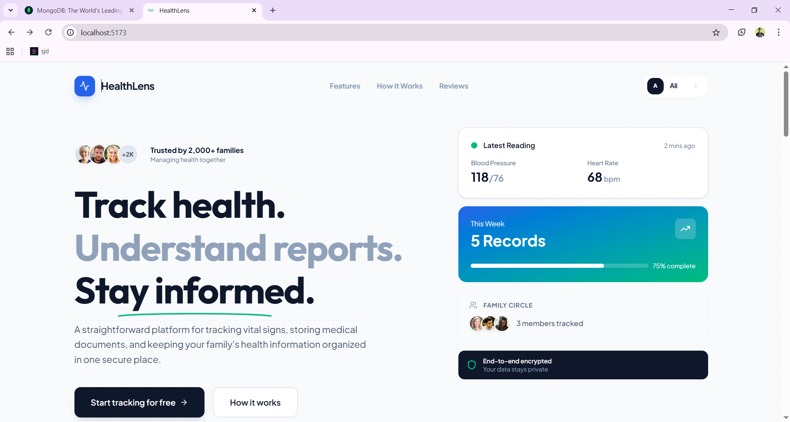
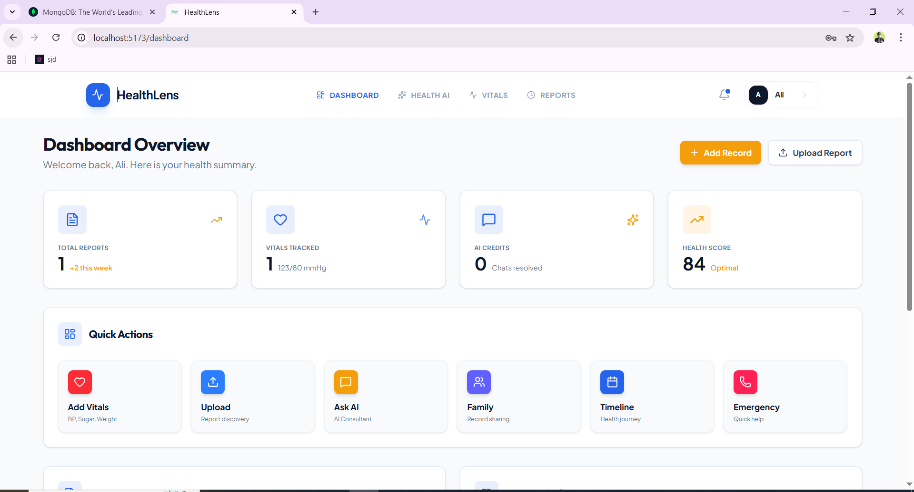

# HealthLens

A smart health management platform that helps you track vitals, understand medical reports, and manage family health records in one place.



## What is HealthLens?

HealthLens is a web app that makes managing your health simple. Upload medical reports and get easy-to-understand summaries powered by AI. Track your vitals like blood pressure and blood sugar over time. Keep everything organized for yourself and your family members.

## Features

- **Vitals Tracking** - Record and monitor blood pressure, blood sugar, weight, and temperature
- **Smart Report Analysis** - Upload medical reports (PDF, images) and get AI-powered summaries
- **Family Health Management** - Add family members and track their health records separately
- **AI Health Assistant** - Chat with an AI to ask health questions and get instant answers
- **Health Timeline** - View your complete health history with charts and trends
- **Secure Storage** - All your health data is encrypted and stored safely



## Tech Stack

### Frontend

- **React 19** - UI library
- **Vite** - Build tool
- **React Router** - Navigation
- **Redux Toolkit** - State management
- **Tailwind CSS** - Styling
- **Axios** - HTTP requests
- **Lucide React** - Icons
- **React Toastify** - Notifications

### Backend

- **Node.js** - Runtime
- **Express** - Web framework
- **MongoDB** - Database
- **Mongoose** - ODM
- **Google Gemini AI** - AI-powered summaries and chat
- **JWT** - Authentication
- **Cloudinary** - File storage
- **Multer** - File uploads
- **bcryptjs** - Password hashing

## Getting Started

### Prerequisites

- Node.js (version 18 or higher)
- MongoDB (local or Atlas)
- Cloudinary account
- Google Gemini API key

### Installation

1. **Clone the repository**

```bash
git clone https://github.com/ghulamali17/HealthLens
cd HealthLens
```

2. **Install backend dependencies**

```bash
cd backend
npm install
```

3. **Install frontend dependencies**

```bash
cd ../frontend
npm install
```

### Environment Setup

Create a `.env` file in the `backend` folder:

```env
PORT=3001
MONGODB_URI=your_mongodb_connection_string
JWT_SECRET=your_jwt_secret_key
GEMINI_API_KEY=your_google_gemini_api_key
CLOUDINARY_CLOUD_NAME=your_cloudinary_cloud_name
CLOUDINARY_API_KEY=your_cloudinary_api_key
CLOUDINARY_API_SECRET=your_cloudinary_api_secret
```

Create a `.env` file in the `frontend` folder:

```env
VITE_API_URL=http://localhost:3001
```

### Running the App

1. **Start the backend server**

```bash
cd backend
npm start
```

The server will run on `http://localhost:3001`

2. **Start the frontend (in a new terminal)**

```bash
cd frontend
npm run dev
```

The app will open at `http://localhost:5173`

## Project Structure

```
HealthLens/
├── backend/
│   ├── config/          # Database and service configs
│   ├── controllers/     # Request handlers
│   ├── middlewares/     # Auth and validation
│   ├── models/          # MongoDB schemas
│   ├── routes/          # API endpoints
│   └── server.js        # Entry point
│
├── frontend/
│   ├── src/
│   │   ├── components/  # Reusable UI components
│   │   ├── features/    # Feature-specific modules
│   │   ├── pages/       # Page components
│   │   ├── store/       # Redux store
│   │   ├── context/     # React context
│   │   ├── routes/      # Route definitions
│   │   └── config/      # Frontend configs
│   └── public/          # Static assets
│
└── README.md
```

## Main Features Explained

### 1. Dashboard

Your main hub shows:

- Total reports uploaded
- Recent vitals readings
- Quick actions (add vitals, upload report, chat with AI)
- Health tips
- Recent activity

### 2. Report Upload & Analysis

- Upload medical reports (PDF, images, Word docs)
- AI reads the report and creates a simple summary
- Download the summary as HTML
- View all your reports in one place

### 3. Vitals Tracking

- Add blood pressure, blood sugar, weight, temperature
- Track for yourself or family members
- View history with dates
- See averages and trends

### 4. AI Health Chat

- Ask health questions anytime
- Get instant responses from AI
- View chat history
- Start new conversations

### 5. Family Members

- Add family members with their details
- Track their health separately
- Manage multiple profiles

## API Endpoints

### Authentication

- `POST /api/auth/register` - Create new account
- `POST /api/auth/login` - Login
- `GET /api/users/current` - Get logged-in user

### Vitals

- `POST /api/vitals/additem` - Add new vital record
- `GET /api/vitals/useritems` - Get all vitals
- `DELETE /api/vitals/deleteitem/:id` - Delete vital

### Reports

- `POST /api/reports/upload` - Upload and analyze report
- `GET /api/reports` - Get all reports
- `GET /api/reports/:id` - Get single report

### Chat

- `POST /api/healthlens` - Send message to AI
- `GET /api/chat/sessions/:userId` - Get chat sessions
- `POST /api/chat/save` - Save chat message

### Family

- `POST /api/family` - Add family member
- `GET /api/family` - Get all family members
- `DELETE /api/family/:id` - Remove family member

## Design System

The app uses a consistent design with:

- **Fonts**: Outfit (headings), Plus Jakarta Sans (body)
- **Colors**: Primary blue, emerald green, slate grays
- **Rounded corners** and **smooth shadows** everywhere
- **Responsive** design that works on all devices
- **Dark mode** support (in progress)

## Contributing

We welcome contributions! Here's how:

1. Fork the repository
2. Create a new branch (`git checkout -b feature/your-feature`)
3. Make your changes
4. Commit (`git commit -m 'Add some feature'`)
5. Push (`git push origin feature/your-feature`)
6. Open a Pull Request

## Known Issues

- Dark mode is partially implemented
- Some mobile views need optimization
- File upload size is limited to 10MB

## Future Plans

- [ ] Add medication reminders
- [ ] Export health data as PDF
- [ ] Doctor appointment scheduling
- [ ] Health goals and tracking
- [ ] Integration with fitness trackers

## License

This project is open source and available under the MIT License.

## Support

If you have questions or run into issues:

1. Check the existing issues on GitHub
2. Create a new issue with details
3. Reach out to the team

---

Made with ❤️ for better health management
